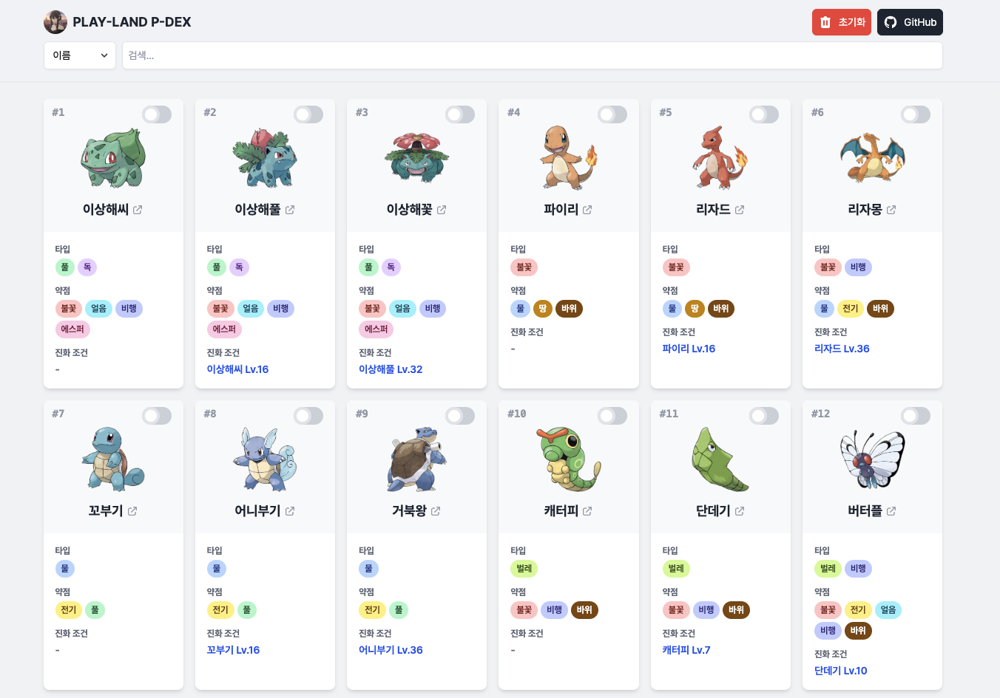

# 📖 P-Dex (포켓몬 도감)

Vanilla JavaScript와 Tailwind CSS를 사용하여 제작된 웹 기반 포켓몬 도감 프로젝트입니다. 다양한 세대의 포켓몬 도감을 탐색하고, 나만의 포획 기록을 관리할 수 있습니다.


**LIVE DEMO**: https://rukawa-dev.github.io/p-dex/

---

## ✨ 주요 기능

- **🌐 다중 도감 지원**:
  - **전국도감**, **팔데아도감**, **ZA도감**, **ZA DLC 도감** 등 원하는 도감을 선택하여 볼 수 있습니다.
  - 각 도감의 데이터는 독립적으로 관리되며, `localStorage`에 마지막으로 선택한 도감이 저장됩니다.

- **🧬 폼 체인지 및 메가진화 지원**:
  - **메가진화** (X/Y), **거다이맥스**, **리전폼** (알로라, 가라르, 히스이, 팔데아) 등 다양한 모습을 확인할 수 있습니다.
  - 관련 폼이 있는 포켓몬 카드의 버튼을 클릭하여 이미지와 타입, 이름을 즉시 전환할 수 있습니다.

- **🔍 강력한 검색 기능**:
  - **이름으로 검색**: 검색어와 일치하는 포켓몬 카드로 즉시 스크롤하고 하이라이트합니다. (Enter/Shift+Enter로 다음/이전 결과 이동)
  - **조건별 필터링**: **도감번호**, **타입**, **진화 조건**으로 검색 시, 조건에 맞는 포켓몬만 필터링하여 보여줍니다.

- **📝 개인화된 포획 관리**:
  - **'잡음' 상태 저장**: 각 포켓몬의 '잡음' 상태를 토글하여 기록할 수 있습니다.
  - **도감별 데이터 분리**: '잡음' 상태는 **각 도감별로 독립적으로** 브라우저의 `localStorage`에 저장되어, 도감이 전환해도 기록이 유지됩니다.
  - **잡은 포켓몬 숨기기**: '숨기기' 버튼으로 잡은 포켓몬을 목록에서 일시적으로 숨길 수 있습니다.
  - **데이터 초기화**: 현재 보고 있는 도감의 '잡음' 기록만 선택적으로 초기화할 수 있습니다.

- **📱 반응형 UI 및 편의 기능**:
  - 모바일과 데스크톱 등 다양한 화면 크기에 최적화된 UI를 제공합니다.
  - 포켓몬 이름을 클릭하면 해당 포켓몬의 **팬덤 위키** 페이지로 이동합니다.
  - 이미지 **지연 로딩(Lazy Loading)**으로 초기 로딩 속도를 개선했습니다.
  - **맨 위/아래로 이동** 버튼으로 긴 목록을 쉽게 탐색할 수 있습니다.

## 🛠️ 기술 스택

- **Frontend**: HTML, CSS, Vanilla JavaScript
- **Styling**: [Tailwind CSS](https://tailwindcss.com/)
- **Data Source**: [PokeAPI (v2)](https://pokeapi.co/), 직접 수집한 JSON 데이터
- **Build Tool**: [Node.js](https://nodejs.org/), [npm](https://www.npmjs.com/)
- **Dev Tools**: [concurrently](https://www.npmjs.com/package/concurrently) (동시 스크립트 실행)

## 🚀 프로젝트 실행 방법

### 1. 의존성 설치

프로젝트를 클론한 후, 필요한 개발 의존성을 설치합니다.

```bash
npm install
```

### 2. 포켓몬 데이터 생성

도감을 표시하기 위해 먼저 PokeAPI로부터 데이터를 가져와 `pokemon.json` 파일을 생성해야 합니다.

- **테스트용 전국도감 데이터 생성 (1~30번)**
  ```bash
  npm run data:test
  ```

- **전체 전국도감 데이터 생성 (1~1025번)**
  *(주의: API 호출이 많아 몇 분 정도 소요될 수 있습니다. `varieties` 데이터를 포함하여 시간이 더 소요될 수 있습니다.)*
  ```bash
  npm run data:all
  ```

- **커스텀 도감 데이터 생성 (ZA, Paldea 등)**
  `pokemon.json`이 먼저 생성되어 있어야 합니다.
  ```bash
  npm run data:za
  npm run data:za:dlc
  npm run data:paldea
  ```

### 3. 개발 서버 실행

Tailwind CSS를 실시간으로 빌드하며, 로컬에서 프로젝트를 확인하려면 `dev` 스크립트를 실행하세요.

```bash
npm run dev
```

이후 `index.html` 파일을 브라우저에서 열면 도감을 확인할 수 있습니다.

---

## 📂 프로젝트 구조

```
/
├── favicon_io/         # 파비콘 파일
├── node_modules/       # npm 패키지
├── pokemon.json        # (생성) 전국도감 데이터 (Forms 포함)
├── pokemon-paldea.json # 팔데아도감 데이터
├── pokemon-za.json     # ZA도감 데이터
├── pokemon-za-dlc.json # ZA DLC 도감 데이터
├── index.html          # 메인 페이지
├── index.js            # 클라이언트 사이드 로직 (UI, 검색, 이벤트, 폼 전환)
├── sidebar.js          # 사이드바 제어 로직
├── load-data.js        # (Node.js) 전국도감 및 폼 데이터 생성 스크립트
├── load-data-custom.js # (Node.js) 커스텀 도감 생성 스크립트
├── input.css           # Tailwind CSS 소스 파일
├── output.css          # 빌드된 Tailwind CSS 파일
├── package.json        # 프로젝트 정보 및 스크립트
├── README.md           # 프로젝트 설명서
├── tailwind.config.js  # Tailwind CSS 설정 파일
└── .antigravityrules   # AI 어시스턴트 규칙 파일
```

---

## 📝 라이선스 (License)

본 프로젝트의 소스 코드에 대한 저작권은 rukawa-dev에게 있습니다.

**허용 범위**: 개인적인 학습 목적의 코드 참조 및 열람.

**금지 사항**: 사전 승인 없는 코드의 무단 복제, 수정, 재배포 및 상업적 이용을 엄격히 금지합니다.

**문의**: https://litt.ly/softland

Copyright © rukawa-dev. All rights reserved. No part of this source code may be reproduced, distributed, or transmitted in any form or by any means without the prior written permission of the copyright holder.

---

## ⚖️ 면책 조항 (Disclaimer)

본 프로젝트는 개인적인 학습 및 포트폴리오 목적으로 제작된 **비영리 팬 프로젝트**이며, 이를 통해 어떠한 금전적 이득도 취하지 않습니다.

- 모든 포켓몬 데이터와 이미지는 [PokeAPI](https://pokeapi.co/)를 통해 제공받았거나, 공개된 정보를 기반으로 수집되었습니다.
- Pokémon 및 모든 관련 이름, 이미지, 상표는 © Nintendo, Creatures Inc., GAME FREAK Inc.의 저작권 및 상표입니다.
- 본 프로젝트는 상기 언급된 회사들과 공식적인 관련이 없으며, 어떠한 제휴 관계도 맺고 있지 않습니다.
- 본 프로젝트를 통해 발생할 수 있는 모든 문제에 대해 제작자는 책임을 지지 않습니다.
